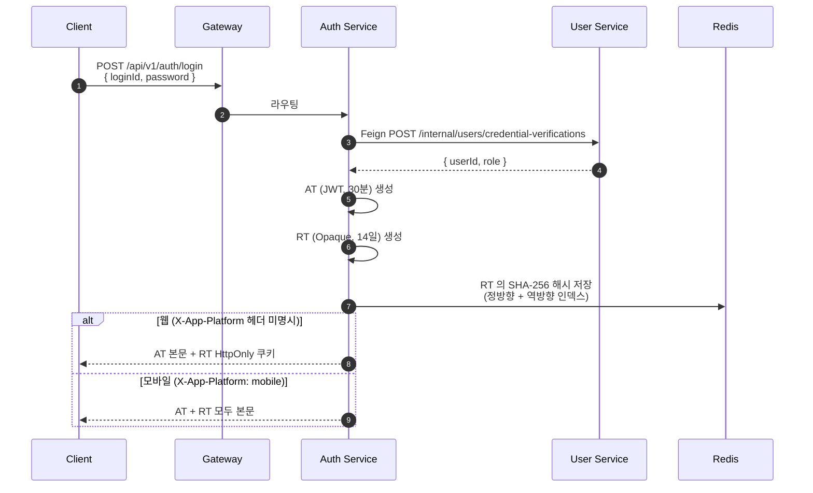
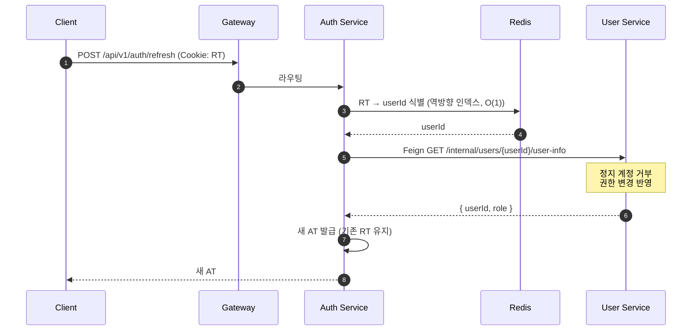
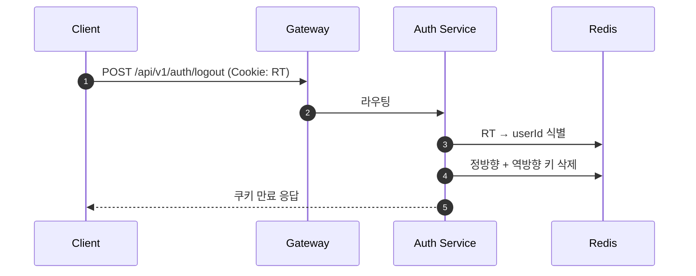
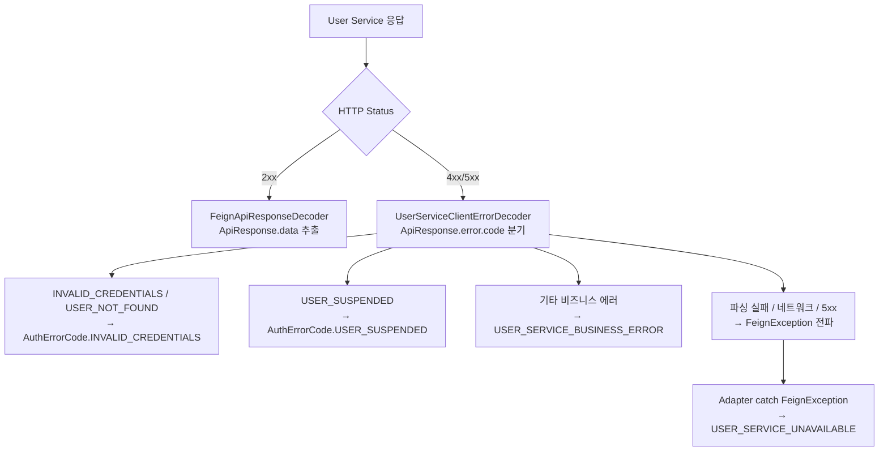

# Pagely — Auth Service

Pagely MSA 의 인증 책임 서비스. 로그인 / 토큰 발급 / 갱신 / 무효화의 책임

초기 MVP 단계에서는 User Service 가 인증 책임을 같이 가지고 있었으나, MSA 의 도메인 경계 원칙에 따라 Auth Service로 분리되었습니다.

## 책임

- 로그인 (자격 검증 + 토큰 발급)
- 토큰 갱신 (실시간 권한 / 정지 상태 반영)
- 로그아웃 (Refresh Token 무효화)
- RT 화이트리스트 관리 (Redis)
- User Service Feign 통신 (자격 검증 / 권한 재조회)

## 기술 스택

- Java 21, Spring Boot 3.5.13
- Redis (RT 화이트리스트)
- Spring Cloud OpenFeign (User Service 통신)
- jjwt (JWT, HS256)
- Eureka / Config Server

## 사용자 시나리오

### 1. 로그인



### 2. 토큰 갱신



### 3. 로그아웃



## 토큰 전략

### Access Token (AT)

- JWT (HS256)
- 만료 30분
- Claims: `iss`, `sub` (userId UUID), `role`, `iat`, `exp`, `jti`
- Stateless — 매 API 호출에서 Redis 부하 X
- 서명 검증으로 위변조 방지

### Refresh Token (RT)

- Opaque (`SecureRandom` 의 256bit 랜덤)
- 만료 14일
- Stateful — Redis 화이트리스트로 즉시 무효화 가능
- 무거운 JWT 대신 SHA-256 해시 저장 (Redis 노출 시 원본 보호)

## RT 저장 구조 (Redis)

양방향 인덱스 패턴.

```
정방향: auth-service:rt:{userId}            → tokenHash
역방향: auth-service:rt:index:{tokenHash}   → userId
TTL: 14일 (자동 만료)
```

- 정방향: 사용자별 단일 RT 정책 (덮어쓰기 시점 활용)
- 역방향: RT → userId 식별 (`refresh` / `logout` 시 O(1))
- 새 로그인 시 옛 RT 의 양쪽 키 자동 정리

### 양방향 인덱스의 가치

Opaque RT는 자체로 의미있는 정보를 가지지 않음 X

따라서 `refresh` / `logout`시 요청에서 전달된 RT를 통해
Redis에 저장된 모든 RT(value)를 비교해가며 토큰의 주인(key)을 찾을 필요가 있음.

| 옵션 | AT 만료 시 | 시간 복잡도 | 채택 |
| --- | --- | --- | --- |
| AT sub 활용 | 동작 X | O(1) | X |
| 전체 스캔 | OK | O(N) | X |
| 양방향 인덱스 | OK | O(1) | ✅ |

OAuth2 표준의 "AT 없이도 RT 만으로 무효화" 흐름 보장.

## User Service 통신 (Feign + Decoder)

선언적 HTTP 호출 + 응답 처리 일원화.

### 응답 처리 흐름



비즈니스 의미 기반 분기 (HTTP status 의존 X), Adapter 의 `catch` 단순화 (1개), 새 에러 추가 시 ErrorDecoder 만 수정.

## 보안 설계

### Bearer Token 모델

"RT 가진 사람 = 주인" 가정. 서버의 진짜 주인 검증 X.

서버 책임:
- HttpOnly + Secure + SameSite=Strict 쿠키 (XSS / CSRF 방지)
- 짧은 TTL (14일)
- Phase 2 의 RT 회전 / 디바이스 fingerprinting

### Fail-Close 정책

Redis 다운 시 토큰 갱신 거부. Fail-Open (Redis 다운 시 허용) 대비 보안 우선.

### JWT secret 길이 검증

HS256 의 256bit 요구. 짧은 secret 거부 (운영 시점의 실수 방지).

### Enumeration 공격 방지

"사용자 없음" / "비밀번호 불일치" 같은 응답. loginId 의 존재 여부 노출 X.

## API

### POST /api/v1/auth/login

```bash
# 웹
curl -X POST http://localhost:8080/api/v1/auth/login \
  -H "Content-Type: application/json" \
  -d '{ "loginId": "test_user", "password": "TestPassword!1" }'

# 모바일
curl -X POST http://localhost:8080/api/v1/auth/login \
  -H "Content-Type: application/json" \
  -H "X-App-Platform: mobile" \
  -d '{ "loginId": "test_user", "password": "TestPassword!1" }'
```

### POST /api/v1/auth/refresh

```bash
curl -X POST http://localhost:8080/api/v1/auth/refresh \
  -H "Cookie: refreshToken=..."
```

### POST /api/v1/auth/logout

```bash
curl -X POST http://localhost:8080/api/v1/auth/logout \
  -H "Cookie: refreshToken=..."
```

## 패키지 구조

```
com.pagely.authservice/
├── domain/
│   ├── model/          (AccessToken, RefreshToken, TokenPair 등)
│   ├── exception/      (AuthErrorCode)
│   └── repository/     (RefreshTokenRepository 인터페이스)
├── application/
│   ├── service/        (AuthApplicationService)
│   ├── dto/            (LoginCommand, RefreshCommand, LogoutCommand 등)
│   └── port/           (JwtTokenProvider, UserCredentialProvider)
├── infrastructure/
│   ├── client/         (UserServiceClient Feign 인터페이스 + Decoder)
│   ├── provider/       (UserCredentialVerifyProviderAdapter 등)
│   ├── persistence/    (RedisRefreshTokenRepository)
│   ├── jwt/            (JjwtTokenProvider, JwtProperties)
│   └── util/           (CookieUtil)
└── presentation/
    ├── controller/     (AuthController)
    └── dto/            (LoginRequest, AuthTokenResponse 등)
```

## 실행

### 사전 조건

- Java 21
- Redis
- Eureka / Config Server
- User Service (Feign 통신 대상)
- 환경 변수: `JWT_SECRET` (HS256 의 256bit, base64)

### 기동

```bash
./gradlew bootRun
```

### 빌드 (Docker)

```bash
./gradlew bootBuildImage
docker run -p 19091:19091 \
  -e JWT_SECRET=... \
  -e REDIS_HOST=localhost \
  -e EUREKA_SERVER_URL=http://localhost:8000/eureka/ \
  pagely-auth-service:latest
```

## 환경 변수

| 키 | 설명 | 기본값 |
| --- | --- | --- |
| `JWT_SECRET` | JWT 서명 키 (HS256, base64) | 필수 |
| `REDIS_HOST` / `REDIS_PORT` | Redis 주소 | localhost / 6379 |
| `EUREKA_SERVER_URL` | Eureka 주소 | `http://localhost:8000/eureka/` |
